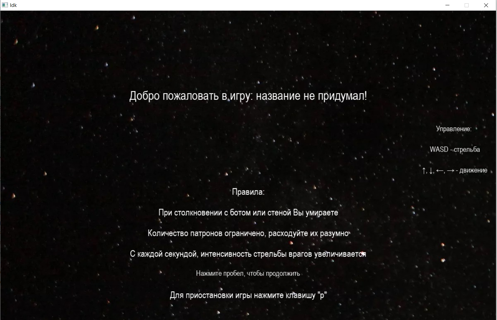
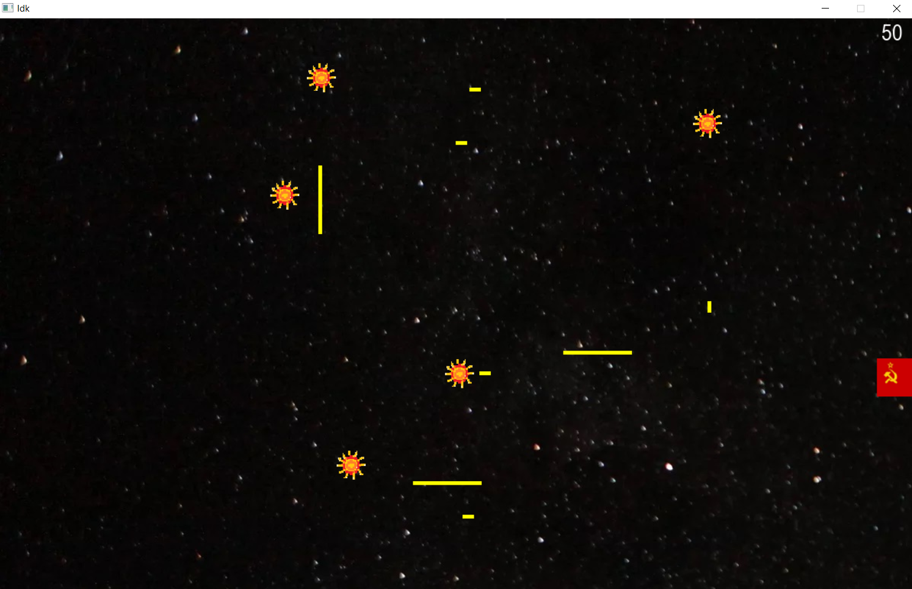
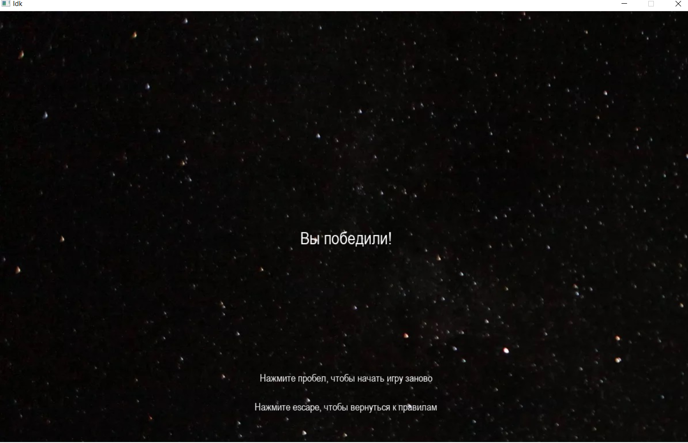

Игра написана на языке Python с использованием библиотеки Pygame.
Цель игры: уничтожить вражеские объекты.

В игре есть стены, через которые не могут пролетать объекты. Вражеские объекты умеют отстреливаться. Управление производится посредством клавиш: ←, →, ↑, ↓, WASD, пробел.
Вражеские объекты запрограммированы по максимуму избегать столкновений со стенами. Количество выстрелов ограничивается 50ю. Со временем, сложность повышается. 
Вот так выглядит интерфейс:

Экран победы:

